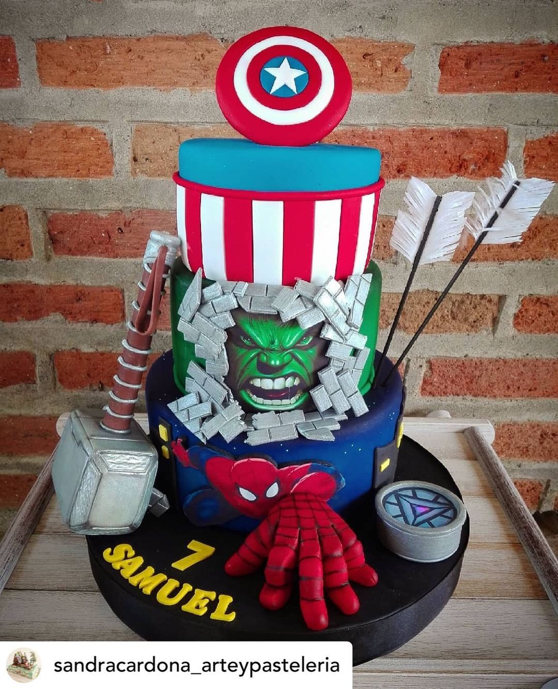
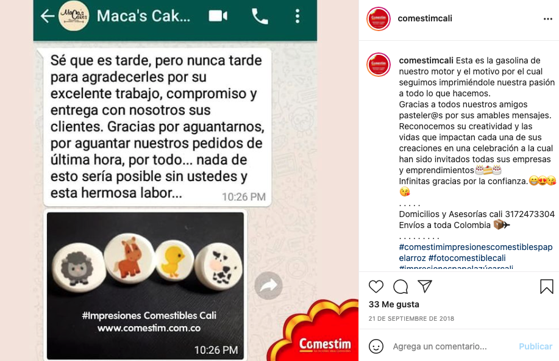

## Sobre el producto

- Producto seleccionado.
  - Comestim: soluciones en impresión comestible en papel de arroz y azucar.
- ¿En qué consiste y qué servicio ofrece? ¿Qué hace? ¿Cómo funciona actualmente?
  - Venta y comercialización de impresiones comestibles.
  - Su enfoque es hacia pasteleros.
- Enlistar las propuestas de la estrategia y por cada una explicar el motivo por el cual sería efectiva.
  1. Impulso a la comunidad pastelera: a través de "Social proof" podemos resaltar los esfuerzos que comestim realiza con sus clientes pasteleros. Marcando una relación de ganar-ganar para que mas pasteleros quieran formar parte de la comunidad.
  2. Campañas en Instagram mostrando los mejores pasteles: Los pasteleros que formen parte de la comunidad podrán enviar sus diseños realizados a las redes de Comestim. Con esto le damos foco al talento del pastelero y al resultado que puedes realizar con nuestros productos.

## Commitment and consistency

### 1. Ser un buen padre vs ser un mal padre

| Tu pastel con Comestim                                        | El pastel del vecino que "cobra barato"                       |
| ------------------------------------------------------------- | ------------------------------------------------------------- |
|  |  |

### 2. Formar parte de una comunidad
Tu puedes ser parte de nuestra comunidad de artistas que día a día crean hermosos pasteles. ¡Envíanos un DM para mas información!
 
 

### 3. Concurso al "mejor pastel"
 
"Te invitamos a participar con el hashtag #EsteEsMiPastel para que nos muestres tu trabajo realizado con Comesstim. Podrás participar para ganar ... "

## Social Proof

### Demostraciones de "usted tómo la elección correcta"
"... Así como ella, tu puedes tener los mejores diseños en tus pasteles ..."

### Valoración de nuestro producto, comunidad e interés genuino
A través de nuestra comunidad de pasteleros, se construyen vínculos especiales. La relación no es "cliente-proveedor" sino de compañeros.

A su vez mostramos valor en nuestro producto con la ayuda del cliente.

